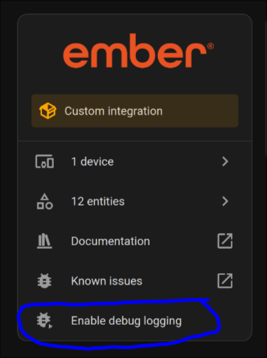
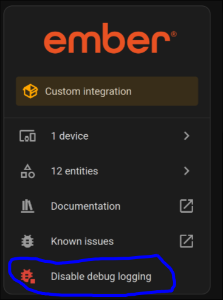
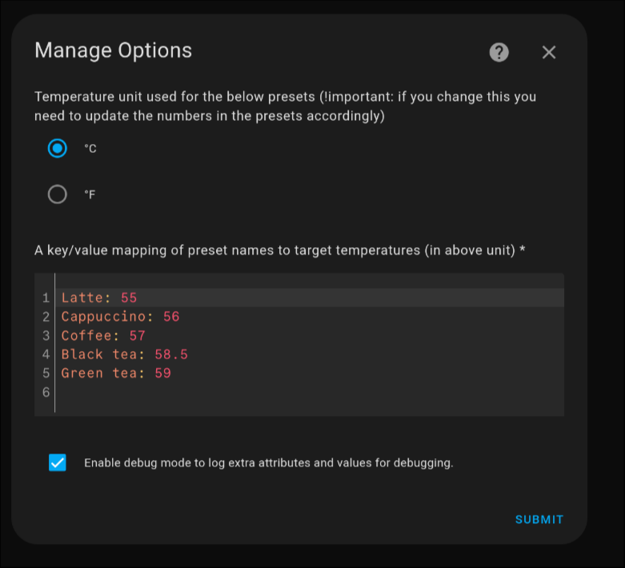

# [Ember Mug Integration for Home Assistant](https://github.com/sopelj/hass-ember-mug-component)

[](https://github.com/sopelj/hass-ember-mug-component/releases)

[](https://github.com/sopelj)
[](LICENSE.md)
[](https://github.com/custom-components/hacs)
[](https://github.com/pre-commit/pre-commit)


A custom integration for Ember Mugs, Cups, Tumblers and Travel Mugs for Home Assistant. All known devices are tested and working.
If I missed one, or you have new feature ideas or issues, please [create an issue](https://github.com/sopelj/hass-ember-mug-component/issues) if it does not already exist.
The actual device logic is in [an external library](https://github.com/sopelj/python-ember-mug) as per the guidelines in Home Assistant. So if you have an issue not specifically related to the Home Assistant part, please [raise the issue there instead](https://github.com/sopelj/python-ember-mug/issues) :)

| Device       | Tested |
|--------------|--------|
| Mug          | ✓      |
| Mug 2        | ✓      |
| Cup          | ✓      |
| Tumbler      | ✓      |
| Travel Mug   | ✓      |
| Travel Mug 2 | ✓      |

> **Note**
> The latest version should always work on the latest version of Home Assistant.
> However, some older versions only work on certain versions of Home Assistant.
> Please see [Changelog.md](./CHANGELOG.md) for details if you need an older one.

## Installation / Setup

### Install via HACS

You can click the button below to open this repository in HACS or you can manually search for "Ember Mug" in HACS.

[](https://my.home-assistant.io/redirect/hacs_repository/?owner=sopelj&repository=hass-ember-mug-component&category=integration)

### Prerequisites

You need to have either a [Bluetooth Proxy](https://www.home-assistant.io/integrations/bluetooth/#remote-adapters-bluetooth-proxies) or a supported Bluetooth dongle that is configured with [Home Assistant's Bluetooth Integration](https://www.home-assistant.io/integrations/bluetooth/).
Bluetooth Proxies seem to be far more reliable now, so, if you have that option you will be less likely to have issues with connectivity and errors unique to your specific setup.

#### Option 1 - [Bluetooth Proxy](https://www.home-assistant.io/integrations/bluetooth/#remote-adapters-bluetooth-proxies) (Recommended)

Ensure you have at least one [Bluetooth Proxy](https://www.home-assistant.io/integrations/bluetooth/#remote-adapters-bluetooth-proxies) setup with Home Assistant that supports **active connections**.
Currently, that only includes ESPHome proxies with firmware 2022.9.3 or later. In theory, you can have multiple proxies setup throughout the house as well.

#### Option 2 - [Home Assistant's Bluetooth Integration](https://www.home-assistant.io/integrations/bluetooth/) with integrated adapter or dongle

Ensure you have the [Home Assistant Bluetooth Integration](https://www.home-assistant.io/integrations/bluetooth/) enabled and have integrated Bluetooth or Bluetooth Dongle setup with it.
It is recommended to use one of the [officially supported adapters](https://www.home-assistant.io/integrations/bluetooth/#known-working-adapters).
There are many different adapters and support varies greatly. If you have issues with your specific Bluetooth adapter, it may be worth trying with a Bluetooth Proxy.

### Setting up your Mug

In order to function fully, you may need to set up your device using the app before trying to use this integration.
This is not required, but if you don't, changing values such as the name, colour, temp, etc. via home assistant **may** not work.
Once you set it up, please forget the mug on your phone or at least disable Bluetooth, so they don't fight over the device.

1. Set your device in the Ember mobile app
2. Forget your device from your Bluetooth Devices on your phone (or at least disable Bluetooth on it).
3. Put your device into pairing mode:
   - For the Mug/Cup; hold down the button on the bottom until it flashes blue
   - For the Travel Mug; press and hold the Ember logo until the display shows 'PAIR'
4. Home Assistant should auto-detect your device, and you should get a notification to set it up<br/>
   <br/>
   Choose "Check it out" or go to "Settings" -> "Devices"
5. In your devices you should see an option at the top under "Discovered" for the new device<br/>
   <br/>
   Then choose "Configure"
6. In the prompt you can choose a different name if you prefer and then choose "Submit".<br/>
   <br/>
7. It will then try and connect to the device. On success, you be prompted to choose a location (default is Kitchen).<br/>
   
8. Your device will exit paring mode automatically and go back to the default colour when it's setup.

> **Note**
> If using the Bluetooth integration you may need to open `bluetoothctl` in order for the pairing to be allowed

#### Dashboard

For an easy and beautiful way to display the state of your device [@Flight-Lab](https://github.com/Flight-Lab)
made an [Ember Mug Card](https://github.com/Flight-Lab/ember-mug-card) for this integration.

#### Troubleshooting

##### Changing modes / button functions

If you are unsure exactly how long to press the buttons, are wish to have more information on the basic functionality of the mug,
you can look at the "Quick Start Guide" that came with your mug, or consult the digital version [on their website](https://support.ember.com/hc/en-us/articles/115002624512-Ember-Mug-Quick-Start-Guide)

##### Device randomly becomes unavailable

If you mug stops updating and becomes unavailable, simply try putting it in pairing mode and waiting 15-60 seconds. It should reconnect automatically.
This doesn't happen often unless using Bluetooth Proxies.

##### Constant Timeouts or `le-connection-abort-by-local`

If, following an upgrade or changing frm a Proxy to a Bluetooth adapter, your mug gets stuck in a state where it refuses to connect,
you get constant reconnects, timeouts, and/or `le-connection-abort-by-local` messages in the debug logs, you may need to remove
your mug via `bluetoothctl remove my-mac-address` and factory reset your device. It should reconnect correctly afterward.
You may also need to re-add it to the app in order to make it writable again as well.

##### 'Operation failed with ATT error: 0x0e' or another connection error

This seems to be caused by the bluetooth adaptor being in some sort of passive mode. I have not yet figured out how to wake it programmatically so sadly, you need to manually open `bluetoothctl` to do so.
Please ensure the mug is in pairing mode (i.e. the light is flashing blue) and run the `bluetoothctl` command. You don,t need to type anything. run it and wait until the mug connects.

If you are on Home Assistant OS you can use the Terminal + SSH addon, open the terminal, type `bluetoothctl` and hit enter.
If you are running in docker or locally via python you can run it on the host.

##### 'Failed to start Bluetooth' - \[org.bluez.Error.NotReady\] Resource Not Ready

This indicates the Bluetooth Adapter is not currently available. Please ensure it is correctly plugged in and powered on.
If you are running in HassOS it should automatically start, but sometimes in docker you might need to start it manually with `bluetoothctl power on`.

##### Does not automatically reconnect to Home Assistant after restart

In some cases people have had issues with built-in adapters not re-connecting automatically after restarting Home Assistant and requiring the device to be in pairing mode to reconnect.
It seems to be sufficient to open `bluetoothctl` and try connecting/pairing the device from there to avoid this issue in future.

#### Connectivity or other issues with Bluetooth

Many things can cause issues with connectivity, such as unsupported adapters and interference.
The [Home Assistant Bluetooth Documentation](https://www.home-assistant.io/integrations/bluetooth/#troubleshooting) has some excellent steps for troubleshooting.

If using Bluetooth Proxies please ensure you are using Home Assistant 2023.4 and ESPHome 2023.2 or later for the best experience

#### Debugging

If something isn't working, and you aren't sure why, you can increase logging levels in Home Assistant in your configuration.yaml to get more information.
Even if you're not sure what it means, it can help debug if you open an issue with this information.

You can enable debug settings in the Integration's page:

1. Option the Ember Mug Integration:<br/>
   [](https://my.home-assistant.io/redirect/integration/?domain=ember_mug)
2. And then choose "Enable Debug Logging"<br/>
   
3. Perform the action that reproduces the issue
4. Go back and click "Disable Debug Logging"<br/>
   
5. A debug log file download automatically that you can consult to help debugging or to provide information when creating an issue.

Also, if you use Bluetooth proxies you can also activate verbose logging in ESPHome with:

```yaml
esp32:
  framework:
    sdkconfig_options:
      CONFIG_BT_LOG_GATT_TRACE_LEVEL: VERBOSE

logger:
  level: VERBOSE
```

##### Device not found or stops updating

On rare occasions the mug may disconnect and have trouble reconnecting. In those cases you can just put your mug back in pairing mode and, it should reconnect within a minute.
If that fails you can try reloading the integration.

## Caveats / known issues:

- The services to change mug values may only work if the mug has been set up in the Ember app initially.
- If you have another device paired with it, like your phone, it will cause it to disconnect, so you need to remove it from that device.
- This maintains a connection to your mug which may affect battery
- With Bluetooth Proxies you may have to put it into pairing mode manually if the battery fully dies.

## Examples

### Automations:

If you want to have notifications similar to the app you can do something like:

> **Note**
>  Replace `c90f59d633f9` with your mug's MAC address and `mug` with your device type if different.

```yaml
automation:
  - id: mug_filled
    alias: Mug Filled
    trigger:
      - platform: state
        entity_id: sensor.ember_mug_c90f59d633f9_state  # your mug entity
        from: empty
        to:
          - filling
          - heating
          - cooling
    action:
      service: notify.mobile_app_jesse_s_pink_razr  # Mobile device notify or other action
      data:
        message: Your mug has been filled

  - id: mug_temp_right
    alias: Mug Temp is right
    trigger:
      - platform: state
        entity_id: sensor.ember_mug_c90f59d633f9_state
        attribute: liquid_state
        from:
          - heating
          - cooling
        to: perfect
    action:
      service: notify.mobile_app_jesse_s_pink_razr  # Mobile device notify or other action
      data_template:
        message: "Your mug is at the desired {{ states('sensor.ember_mug_c90f59d633f9_current_temp') }}."

  - id: mug_battery_warning
    alias: Mug Battery Low
    trigger:
      - platform: numeric_state
        entity_id: sensor.ember_mug_c90f59d633f9_battery_percent
        below: 20
        for:
          minutes: 10
    action:
      service: notify.mobile_app_jesse_s_pink_razr  # Mobile device notify or other action
      data_template:
        message: "Your mug battery is low ({{ states('sensor.ember_mug_c90f59d633f9_battery_percent') }}%)."

```

### Changing Mug values

If your mug was initially setup with the mobile app, you can also change certain thing about your mug.
Either via the device page, lovelace or services in automations.

> **Note**
> Despite being a "light" the LED cannot be turned off. This was simply to provide a convenient UI to set the colour.
>
> The "Temperature Unit" is the internal unit of the mug (used by the app), but does not change the value displayed in Home Assistant.
> The sensors in Home Assistant will already be displayed using your preferred unit (as per your Home Assistant settings).
> They can also be overridden in the settings of each entity if desired. Just click on an entity, click the Gear, and choose another "Unit of Measure".

#### Via the UI

You can change these in de device page via the UI:

[](https://my.home-assistant.io/redirect/devices/)

The entities can also be added to your dashboard if you prefer:


Simply tap on the entity you wish to configure and change the value as desired.

#### Via Scripts/Lovelace/Automations

- Rename your device (`sensor.ember_mug_c90f59d633f9_name`)
- Change the LED colour of the device (`light.ember_mug_c90f59d633f9_led`)
- Set the desired temperature of your device (`number.ember_mug_c90f59d633f9_target_temp`)
- Enable/Disable temperature control - off will not try to heat liquid (`switch.ember_mug_c90f59d633f9_temperature_control`)
- Set the desired temperature of your device from a list of presets (`number.ember_mug_c90f59d633f9_temperature_preset`)
- Set the device's internal temperature unit (`select.ember_mug_c90f59d633f9_temperature_unit`)
- Set the Travel Mug's volume level (`select.ember_travel_mug_d70f69f623f8_volume_level`)

You can also call these in services for your automations.

| Property     | Service              | Params               |
|--------------|----------------------|----------------------|
| Mug Name     | text.set_value       | entity_id and value  |
| LED Colour   | light.turn_on        | entity_id and rgb    |
| Temp Control | switch.turn_on/off   | entity_id            |
| Target Temp  | number.set_value     | entity_id and value  |
| Temp Preset  | select.select_option | entity_id and option |
| Temp Unit    | select.select_option | entity_id and option |
| Volume Level | select.select_option | entity_id and option |

#### Customising presets

If you wish to change or add presets to the preset entity you can do so.
This can be done via the UI by going to this integration and choosing "Configure" next to your device.

[](https://my.home-assistant.io/redirect/integration/?domain=ember_mug)

The "Presets" are a key value mapping of the name to desired temperature. You can add, change or remove as you wish. Names can have spaces if desired, just avoid symbols. Mote that new entries will not benefit from translations however as they are not part of the integration.



> **Important**
> The "Unit" here is not for display. It indicates the unit used in the config, so it can be converted for display if needed.
> If you wish to change it, please remember to update existing entries to that unit as well, as they will be assumed to all be in that unit.

## Development

### Test

```bash
hatch run test:cov
```

### Linting

```bash
pre-commit run --all-files
```


## Notice of Non-Affiliation and Disclaimer

This project is not affiliated, associated, authorized, endorsed by, or in any way officially connected with Ember.

The name Ember as well as related names, marks, emblems and images are registered trademarks of their respective owners.
