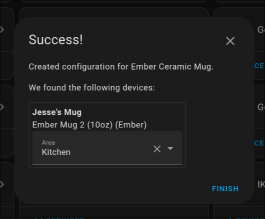

# [Ember Mug Integration for Home Assistant](https://github.com/sopelj/hass-ember-mug-component)

[](https://github.com/sopelj/hass-ember-mug-component/releases)

[](https://github.com/sopelj)
[](LICENSE.md)
[](https://github.com/hacs/integration)
[](https://github.com/pre-commit/pre-commit)


A custom integration for Ember Mugs, Cups and Travel Mugs for Home Assistant.

| Device       | Tested  |
|--------------|---------|
| Mug          | ✓       |
| Mug 2        | ✓       |
| Cup          | ✓       |
| Travel Mug   | ✓       |
| Travel Mug 2 | ?       |

**Note**: Untested devices should still work, if you have one, and it works or doesn't please let me know.

The actual Mug logic has been moved to [an external library](https://github.com/sopelj/python-ember-mug) as per the guidelines in Home Assistant.
So if you have issues with the mug's internals and not the integration with home assistant please [raise issues there](https://github.com/sopelj/python-ember-mug/issues) :)

> **Note**
> The latest version should always work on the latest version of Home Assistant.
> However, some older versions only work on certain versions of Home Assistant.
> Please see [Changelog.md](./CHANGELOG.md) for details if you need an older one.

## Installation / Setup

### Install via HACS

1. Setup [HACS](https://hacs.xyz/docs/basic/getting_started) if you haven't already.
2. Then you can add this repository as a custom repository: `https://github.com/sopelj/hass-ember-mug-component`
3. Install the integration in HACS and restart Home Assistant.

> **Note**
> You do *not* need to manually add the integration in Home Assistant. Just installing it is enough for autodiscovery to work.

### Prerequisite - Set up the Bluetooth Integration

Ensure you have the [Home Assistant Bluetooth Integration](https://www.home-assistant.io/integrations/bluetooth/) enabled, and you also need to have Bluetooth Dongle setup or a Bluetooth Proxy.
If you use a Bluetooth adapter it is recommended to use one of the [officially supported adapters](https://www.home-assistant.io/integrations/bluetooth/#known-working-adapters)
You can also use [Bluetooth Proxies](https://www.home-assistant.io/integrations/bluetooth/#remote-adapters-bluetooth-proxies) as well, just be sure the proxy supports "active" connections and you use Home Assistant 2023.4 or later.

### Setting up your Mug

In order to function properly, you may need to set up your device using the app before trying to use this integration.
This is not required, but if you don't, changing values such as the name, colour, temp, etc. via home assistant may not work.
Once you set it up, please forget the mug on your phone or at least disable Bluetooth, so they don't fight over the device.

1. Set your device in the Ember mobile app
2. Forget your device from your Bluetooth Devices on your phone (or at least disable Bluetooth on it).
3. Home Assistant should auto-detect your device, and you should get a notification to set it up<br/>
   
   Choose "Check it out" or go to "Settings" -> "Devices"
4. In your devices you should see an option for the mug<br/>
   
   Then choose "Configure"
5. In the prompt change any options you wish.<br/>
   
   **You probably don't want extra attributes, they are for debugging and development only**
   Then hit "Next"
6. It will then try and connect to the device. On success, you be prompted to choose a location.<br/>
   
7. Once it has been added, then put your device into pairing mode
   - For the Mug/Cup; hold down the button on the bottom until it flashes blue
   - For the Travel Mug; press and hold the Ember logo until the display shows 'PAIR'
8. Your device will exit paring mode automatically and go back to the default colour when it's setup.

> **Note**
> If using Bluetooth Proxies please ensure you are using Home Assistant 2023.4 and ESPHome 2023.2 or later for best experience

#### Troubleshooting

##### Changing modes / button functions

If you are unsure exactly how long to press the buttons, are wish to have more information on the basic functionality of the mug,
you can look at the "Quick Start Guide" that came with your mug, or consult the digital version [on their website](https://support.ember.com/hc/en-us/articles/115002624512-Ember-Mug-Quick-Start-Guide)

##### Device randomly becomes unavailable

If you mug stops updating and becomes unavailable, simply try putting it in pairing mode and waiting 15-60 seconds. It should reconnect automatically.
This doesn't happen often unless using Bluetooth Proxies.

##### 'Operation failed with ATT error: 0x0e' or another connection error

This seems to be caused by the bluetooth adaptor being in some sort of passive mode. I have not yet figured out how to wake it programmatically so sadly, you need to manually open `bluetoothctl` to do so.
Please ensure the mug is in pairing mode (i.e. the light is flashing blue) and run the `bluetoothctl` command. You don,t need to type anything. run it and wait until the mug connects.

If you are on Home Assistant OS you can use the Terminal + SSH addon, open the terminal, type `bluetoothctl` and hit enter.
If you are running in docker or locally via python you can run it on the host.

##### 'Failed to start Bluetooth' - \[org.bluez.Error.NotReady\] Resource Not Ready

This indicates the Bluetooth Adapter is not currently available. Please ensure it is correctly plugged in and powered on.
If you are running in HassOS it should automatically start, but sometimes in docker you might need to start it manually with `bluetoothctl power on`.

##### Does not automatically reconnect to Home Assistant after restart

In some cases people have had issues with built-in adapters not re-connecting automatically after restarting Home Assistant and requiring the device to be in pairing mode to reconnect.
It seems to be sufficient to open blutoothctl and try connecting/pairing the device from there to avoid this issue in future.

#### Connectivity or other issues with Bluetooth

Many things can cause issues with connectivity, such as unsupported adapters and interference.
The [Home Assistant Bluetooth Documentation](https://www.home-assistant.io/integrations/bluetooth/#troubleshooting) has some excellent steps for troubleshooting.

If using Bluetooth Proxies please ensure you are using Home Assistant 2023.4 and ESPHome 2023.2 or later for the best experience

#### Debugging

If something isn't working, and you aren't sure why, you can increase logging levels in Home Assistant in your configuration.yaml to get more information.
Even if you're not sure what it means, it can help debug if you open an issue with this information.

```yaml
logger:
    default: error  # or whatever you want
    logs:
      custom_components.ember_mug: debug
      ember_mug: debug
      bleak.backends.bluezdbus.client: debug
      bleak_retry_connector: debug
```

You need to restart for it to take effect. You can see your logs here:

[](https://my.home-assistant.io/redirect/logs/)

Also, if you use Bluetooth proxies you can also activate verbose logging in ESPHome with:

```yaml
esp32:
  framework:
    sdkconfig_options:
      CONFIG_BT_LOG_GATT_TRACE_LEVEL: VERBOSE

logger:
  level: VERBOSE
```

##### Device not found or stops updating

On rare occasions the mug may disconnect and have trouble reconnecting. In those cases you can just put your mug back in pairing mode and, it should reconnect within a minute.
If that fails you can try reloading the integration.

## Caveats / known issues:

- The services to change mug values only works if the mug has been set up in the Ember app initially.
- If you have another device paired with it like your phone it will cause it to disconnect, so you need to remove it from that device.
- This maintains a connection to your mug which:
    - may affect battery
    - may interfere with other local bluetooth integrations as it can only maintain one connection at a time.
- With Bluetooth Proxies you may have to put it into pairing mode manually if it disconnects

## Examples

### Automations:

If you want to have notifications similar to the app you can do something like:

> **Note**
>  Replace `c90f59d633f9` with your mug's MAC address.

```yaml
automation:
  - id: mug_filled
    alias: Mug Filled
    trigger:
      - platform: state
        entity_id: sensor.ember_mug_c90f59d633f9_state  # your mug entity
        from: empty
        to:
          - filling
          - heating
          - cooling
    action:
      service: notify.mobile_app_jesse_s_pixel_7  # Mobile device notify or other action
      data:
        message: Your mug has been filled

  - id: mug_temp_right
    alias: Mug Temp is right
    trigger:
      - platform: state
        entity_id: sensor.ember_mug_c90f59d633f9_state
        attribute: liquid_state
        from:
          - heating
          - cooling
        to: perfect
    action:
      service: notify.mobile_app_jesse_s_pixel_7  # Mobile device notify or other action
      data_template:
        message: "Your mug is at the desired {{ states('sensor.ember_mug_c90f59d633f9_current_temp') }}."

  - id: mug_battery_warning
    alias: Mug Battery Low
    trigger:
      - platform: numeric_state
        entity_id: sensor.ember_mug_c90f59d633f9_battery_percent
        below: 20
        for:
          minutes: 10
    action:
      service: notify.mobile_app_jesse_s_pixel_7  # Mobile device notify or other action
      data_template:
        message: "Your mug battery is low ({{ states('sensor.ember_mug_c90f59d633f9_battery_percent') }}%)."

```

### Lovelace

An example for what I use in my lovelace config.
This uses a couple custom lovelace cards, you could do something similar with base widgets, but I've used these here
([battery-state-card](https://github.com/maxwroc/battery-state-card), [lovelace-multiple-entity-row](https://github.com/benct/lovelace-multiple-entity-row) and [stack-in-card](https://github.com/custom-cards/stack-in-card))


```yaml
type: custom:stack-in-card
cards:
  - type: entities
    title: Coffee Time
    icon: mdi:coffee-maker
    show_header_toggle: false
    entities:
      - entity: sensor.ember_mug_c90f59d633f9_state
        type: custom:multiple-entity-row
        entities:
          - entity: light.ember_mug_c90f59d633f9_led
            state_color: true
            icon: mdi:lightbulb
            name: false
      - entity: sensor.ember_mug_c90f59d633f9_current_temp
        type: custom:multiple-entity-row
        name: Temperature
        state_color: true
        show_state: false
        entities:
          - entity: sensor.ember_mug_c90f59d633f9_current_temp
            name: Current
          - entity: number.ember_mug_c90f59d633f9_target_temp
            name: Target
      - type: custom:template-entity-row
        entity: sensor.ember_mug_c90f59d633f9_liquid_level
        name: Liquid Level
        unit: '%'
      - type: custom:battery-state-entity
        name: Battery
        entity: sensor.ember_mug_c90f59d633f9_battery_percent
        charging_state:
          entity_id: binary_sensor.ember_mug_c90f59d633f9_power
```

### Changing Mug values

If your mug was initially setup with the mobile app, you can also change certain thing about your mug.
Either via the device page, lovelace or services in automations.

> **Note**
> Despite being a "light" the LED cannot be turned off. This was simply to provide an easy way to set the colour.
>
> The "Temperature Unit" selected will be written to the mug, but does not change the value displayed in Home Assistant.

#### Via the UI

You can change these in de device page via the UI:

[](https://my.home-assistant.io/redirect/devices/)

The entities can also be added to your dashboard if you prefer:


Simply tap on the entity you wish to configure and change the value as desired.

#### Via Scripts/Lovelace/Automations

- Rename your mug (`sensor.ember_mug_c90f59d633f9_name`)
- Change the LED colour of the mug/cup (`light.ember_mug_c90f59d633f9_led`)
- Set the desired temperature of your device (`number.ember_mug_c90f59d633f9_target_temp`)
- Set the device's internal temperature unit (`select.ember_mug_c90f59d633f9_temperature_unit`)
- Set the Travel Mug's volume level (`select.ember_travel_mug_d70f69f623f8_volume_level`)

You can also call these in services for your automations.

| Property     | Service              | Params               |
|--------------|----------------------|----------------------|
| Mug Name     | text.set_value       | entity_id and value  |
| LED Colour   | light.turn_on        | entity_id and rgb    |
| Target Temp  | number.set_value     | entity_id and value  |
| Temp Unit    | select.select_option | entity_id and option |
| Volume Level | select.select_option | entity_id and option |

## Notice of Non-Affiliation and Disclaimer

This project is not affiliated, associated, authorized, endorsed by, or in any way officially connected with Ember.

The name Ember as well as related names, marks, emblems and images are registered trademarks of their respective owners.
