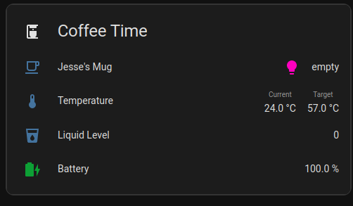

# [Ember Mug Integration for Home Assistant](https://github.com/sopelj/hass-ember-mug-component)

[](https://github.com/sopelj/hass-ember-mug-component/releases)
[](LICENSE.md)
[](https://github.com/hacs/integration)


Custom integration for the Ember Mug in Home Assistant.
It should work with the Ember Mug 1 & 2, but I have not tested with the thermos.
Please let me know if you have another one and are willing to help test it.

The protocol is not public, so there is quite a bit of guesswork involved.
[@orlopau](https://github.com/orlopau) did a great job documenting some [UUIDs here](https://github.com/orlopau/ember-mug) And had to attempt to extract the rest of them.
The rest I had to do some testing and reverse engineering.

The actual Mug logic has been moved to [an external library](https://github.com/sopelj/python-ember-mug) as per the guidelines in Home Assistant.
So if you have issues with the mug's internals and not the integration with home assistant please [raise issues there](https://github.com/sopelj/python-ember-mug/issues) :)

> **Note**
> The latest version should always work on the latest version of Home Assistant.
> However, some older versions only work on certain versions of Home Assistant.
> Please see [Changelog.md](./CHANGELOG.md) for details if you need an older one.

Home Assistant has a list of [officially supported adaptors](https://www.home-assistant.io/integrations/bluetooth/#known-working-adapters),
if you have connection issues, please try one of them.

## Installation / Setup

### Add Repository

Add to HACS as custom repository:

<https://github.com/sopelj/hass-ember-mug-component>

Install the integration in HACS and restart Home Assistant.

> **Note**
> You do *not* need to manually add the integration in Home Assistant. Just installing it is enough for autodiscovery to work.

### Setup Bluetooth Integration

Ensure you have the [Home Assistant Bluetooth Integration](https://www.home-assistant.io/integrations/bluetooth/) enabled, and you have your Bluetooth dongle setup.


### Preparing your Mug

In order to function properly please, set up your mug using the app before trying to use this integration.
This is not required, but if you don't, changing values such as the name, colour, temp, etc. via home assistant will not work.
Once you set it up, then please forget the mug on your phone or at least disable Bluetooth, so they don't fight over the mug.

> **Note**
> If you had a version below 0.4 installed, please remove your device from home assistant and manually remove it in `bluetoothctl remove my-mac-address`.
> You can do this in the Terminal Addon for HASS OS or on your host for other installation types.

To do so:
1. Set up the mug in the Ember mobile app
2. Forget the mug from your Bluetooth Devices on your phone (or at least disable Bluetooth on it).
3. Home Assistant should auto-detect the mug and prompt you to configure it.
   - Choose "Configure"
   - And then hit "Next"
4. Once it has been added, then put your mug into pairing mode (Hold down the button on the bottom until it flashes blue)
5. Your mug will exit paring mode automatically and go back to the default colour when it's setup.

#### Troubleshooting

##### Device randomly becomes unavailable

If you mug stops updating and becomes unavailable, simply try putting it in pairing mode and waiting 15-60 seconds. It should reconnect automatically.
This doesn't happen often unless using Bluetooth Proxies.

##### 'Operation failed with ATT error: 0x0e' or another connection error

This seems to be caused by the bluetooth adaptor being in some sort of passive mode. I have not yet figured out how to wake it programmatically so sadly, you need to manually open `bluetoothctl` to do so.
Please ensure the mug is in pairing mode (i.e. the light is flashing blue) and run the `bluetoothctl` command. You don,t need to type anything. run it and wait until the mug connects.

If you are on Home Assistant OS you can use the Terminal + SSH addon, open the terminal, type `bluetoothctl` and hit enter.
If you are running in docker or locally via python you can run it on the host.

##### 'Failed to start Bluetooth' - \[org.bluez.Error.NotReady\] Resource Not Ready

This indicates the Bluetooth Adapter is not currently available. Please ensure it is correctly plugged in and powered on.
If you are running in HassOS it should automatically start, but sometimes in docker you might need to start it manually with `bluetoothctl power on`.

#### Connectivity or other issues with Bluetooth

Many things can cause issues with connectivity, such as unsupported adapters and interference.
The [Home Assistant Bluetooth Documentation](https://www.home-assistant.io/integrations/bluetooth/#troubleshooting) has some excellent steps for troubleshooting.

##### Device not found or stops updating

On rare occasions the mug may disconnect and have trouble reconnecting. In those cases you can just put your mug back in pairing mode and, it should reconnect within a minute.
If that fails you can try reloading the integration.

## Caveats / known issues:

- The services to change mug values only works if the mug has been set up in the Ember app initially.
- If you have another device paired with it like your phone it will cause it to disconnect, so you need to remove it from that device.
- This maintains a connection to your mug which:
    - may affect battery
    - may interfere with other local bluetooth integrations as it can only maintain one connection at a time.
- With Bluetooth Proxies you may have to put it into pairing mode manually if it disconnects

## Examples

### Automations:

If you want to have notifications similar to the app you can do something like:

*Note*: Replace `c90f59d633f9` with your mug's MAC address.

```yaml
automation:
  - id: mug_filled
    alias: Mug Filled
    trigger:
      - platform: state
        entity_id: sensor.ember_mug_c90f59d633f9_state  # your mug entity
        from: empty
        to:
          - filling
          - heating
          - cooling
    action:
      service: notify.mobile_app_jesse_s_pixel_7  # Mobile device notify or other action
      data:
        message: Your mug has been filled

  - id: mug_temp_right
    alias: Mug Temp is right
    trigger:
      - platform: state
        entity_id: sensor.ember_mug_c90f59d633f9_state
        attribute: liquid_state
        from:
          - heating
          - cooling
        to: perfect
    action:
      service: notify.mobile_app_jesse_s_pixel_7  # Mobile device notify or other action
      data_template:
        message: "Your mug is at the desired {{ states('sensor.ember_mug_c90f59d633f9_current_temp') }}."

  - id: mug_battery_warning
    alias: Mug Battery Low
    trigger:
      - platform: numeric_state
        entity_id: sensor.ember_mug_c90f59d633f9_battery_percent
        below: 20
        for:
          minutes: 10
    action:
      service: notify.mobile_app_jesse_s_pixel_7  # Mobile device notify or other action
      data_template:
        message: "Your mug battery is low ({{ states('sensor.ember_mug_c90f59d633f9_battery_percent') }}%)."

```

### Lovelace

An example for what I use in my lovelace config.
This uses a couple custom lovelace cards, you could do something similar with base widgets, but I've used these here
([battery-state-card](https://github.com/maxwroc/battery-state-card), [lovelace-multiple-entity-row](https://github.com/benct/lovelace-multiple-entity-row) and [stack-in-card](https://github.com/custom-cards/stack-in-card))



```yaml
type: custom:stack-in-card
cards:
  - type: entities
    title: Coffee Time
    icon: mdi:coffee-maker
    show_header_toggle: false
    entities:
      - entity: sensor.ember_mug_c90f59d633f9_state
        type: custom:multiple-entity-row
        entities:
          - entity: light.ember_mug_c90f59d633f9_led
            state_color: true
            icon: mdi:lightbulb
            name: false
      - entity: sensor.ember_mug_c90f59d633f9_current_temp
        type: custom:multiple-entity-row
        name: Temperature
        state_color: true
        show_state: false
        entities:
          - entity: sensor.ember_mug_c90f59d633f9_current_temp
            name: Current
          - entity: number.ember_mug_c90f59d633f9_target_temp
            name: Target
      - type: custom:template-entity-row
        entity: sensor.ember_mug_c90f59d633f9_liquid_level
        name: Liquid Level
        unit: '%'
      - type: custom:battery-state-entity
        name: Battery
        entity: sensor.ember_mug_c90f59d633f9_battery_percent
        charging_state:
          entity_id: binary_sensor.ember_mug_c90f59d633f9_power
```

### Changing Mug values

If your mug was initially setup with the mobile app, you can also change certain thing about your mug.
Either via the device page, lovelace or services in automations.

- Rename your mug (`sensor.ember_mug_c90f59d633f9_name`)
- Change the LED colour of the mug (`light.ember_mug_c90f59d633f9_led`)
- Set the desired temperature of you mug (`number.ember_mug_c90f59d633f9_target_temp`)
- Set the mug's internal temperature unit (`select.ember_mug_c90f59d633f9_temperature_unit`)

You can change these in de device page or the entities can be added to your dashboard:


*Note*: Despite being a "light" the LED cannot be turned off and brightness cannot be adjusted. This was simply to provide an easy way to set the colour.

You can also call these in services for your automations.

| Property    | Service              | Params               |
|-------------|----------------------|----------------------|
| Mug Name    | text.set_value       | entity_id and value  |
| LED Colour  | light.turn_on        | entity_id and rgb    |
| Target Temp | number.set_value     | entity_id and value  |
| Temp Unit   | select.select_option | entity_id and option |
